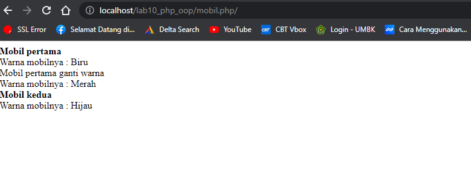

# Lab10Web

# NAMA : Ibnu Fajar
# NIM  : 312010420
# KELAS: TI. 20. A1

**Langkah-langkah Praktikum**
Buat file baru dengan nama *mobil.php* 
 
Dan ini hasilnya ketika kalian lihat dibrowser 
 

Buat file baru dengan nama *form.php* 
 
 
Dan ini hasilnya ketika lihat dibrowser, masih berupa from kosong 
 
